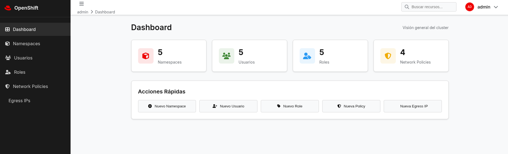

# OpenShift Console - Simplified

A simplified web application for OpenShift administration with a focus on security and networking.

## Features

### ✅ Namespaces

- Create new namespaces
- List and manage existing namespaces
- Delete namespaces
- Assign labels and descriptions

### ✅ User Management

- Create new users
- Assign roles to users
- Manage user status (Active/Inactive)
- Delete users

### ✅ RBAC Roles

- Create custom roles
- Define resources and verbs
- Create ClusterRoles and Roles
- Delete roles

### ✅ Network Policies

- Create network policies (Allow/Deny)
- Configure pod selectors
- Manage ingress/egress
- Delete policies

### ✅ Egress IPs

- Assign egress IPs
- Associate with specific nodes
- Manage egress pools
- Delete egress IPs

## Screenshots

### Main Dashboard


### Namespace Management


## Technologies

- **HTML5**: Semantic structure
- **CSS3**: Responsive design with CSS variables
- **JavaScript (ES6+)**: Interactive functionality
- **Font Awesome**: Iconography
- **Google Fonts (Inter)**: Typography

## Installation

### Option 1: Open Directly
1. Open `index.html` in your browser
2. The application works offline

### Option 2: Local Server
```bash
cd openshift-frontend
python3 -m http.server 8000
# Open: http://localhost:8000
```

## Connecting to Real OpenShift

### 1. Configure Cluster URL
Edit `api-integration.js`:
```javascript
this.baseURL = 'https://your-openshift-cluster.com:6443';
```

### 2. Authentication

The application supports token authentication:

```javascript
openshiftAPI.setToken('your-token-here');
```

### 3. Get Token

```bash
# From OpenShift web console
oc whoami -t
```

## Supported API

### Endpoints
- **Namespaces**: `/api/v1/namespaces`
- **Users**: `/apis/user.openshift.io/v1/users`
- **Roles**: `/apis/rbac.authorization.k8s.io/v1/clusterroles`
- **Network Policies**: `/apis/networking.k8s.io/v1/networkpolicies`
- **Egress IPs**: `/apis/network.openshift.io/v1/hostsubnets`

## Structure

```bash
openshift-frontend/
├── index.html          # Main interface
├── styles.css          # Styles
├── app.js              # JavaScript logic
├── api-integration.js  # API integration
├── README.md           # Documentation
└── screenshots/        # Screenshots
```

## Demo Mode

The application includes simulated data for testing. To connect to a real cluster, configure authentication in `api-integration.js`.

## Security

1. **HTTPS required** for OpenShift connections
2. **Secure tokens**: Use Service Account tokens
3. **RBAC**: Configure minimum required permissions
4. **CORS**: Configure appropriately for local development

## License

MIT

